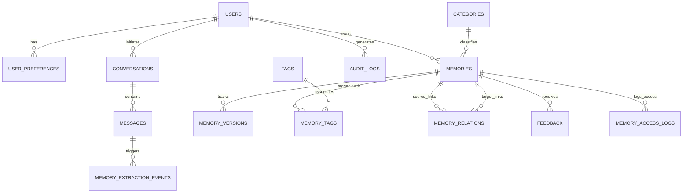

# NeuroVault — Comprehensive Project Documentation & Architecture Blueprint
**Enterprise-Grade AI Memory Management Platform Built on MySQL 8.0+ / 8.4+**  
*Made with ❤️ for DBTHON'26 by Sai Nikhit and Sohan*

---

## 📖 Executive Summary
**NeuroVault** is a full-stack, enterprise-grade AI memory management and cognitive intelligence platform engineered specifically for **MySQL 8.0+ / 8.4+**. Departing strictly from common PostgreSQL/pgvector implementations, NeuroVault proves that MySQL natively excels as a unified engine for:
1. **Relational 3NF Entities** (ACID compliance, foreign keys, triggers, stored procedures, views).
2. **Hybrid Semantic & Keyword Memory Retrieval** (MySQL `JSON` vector arrays combined with native MySQL `FULLTEXT` indexing).
3. **Neuro-Symbolic Cognitive Mechanics** (Ebbinghaus forgetting curve decay, sleep-cycle knowledge synthesis, contradiction reconciliation).
4. **Next-Generation DBMS Innovations** (NL2SQL compiler, microsecond `EXPLAIN` optimizer, multi-hop vector-graph traversal, point-in-time temporal flashback, dynamic data masking, green energy/carbon profiling, and adaptive workload heatmaps).
5. **Document Intelligence & Visual Analytics** (PDF, DOCX, CSV, TXT ingestion with automated Recharts generation).
6. **Modern Responsive UI/UX** (Toggleable Light & Dark modes, glassmorphism styling, interactive analytics).

---

## 🏗️ Technical Architecture & Stack

### Backend Stack
- **Framework**: Python 3.12+ / 3.14+ with **FastAPI**
- **ORM / Query Engine**: **SQLAlchemy 2.0 (Async)** with MySQL `asyncmy` driver (with resilient fallback for test execution)
- **Validation**: Pydantic v2 schemas
- **Security & Authentication**: Salted password hashing (Passlib/Argon2/Bcrypt) + PyJWT bearer authentication
- **Document Processing**: `pypdf`, `python-docx`, `pandas`, `python-multipart`
- **Testing**: Pytest asynchronous test suite

### Frontend Stack
- **Framework**: React 19, TypeScript, Vite
- **Styling**: Tailwind CSS v4 with custom dark-variant tokens (`@custom-variant dark`) & glassmorphism utilities
- **State & Routing**: React Router DOM v7, Context API (`AuthContext`, `ThemeContext`)
- **Visual Analytics**: Recharts (Bar Charts, Pie Charts, Heatmaps, Visual Metrics)
- **Icons**: Lucide React

### Database Architecture: MySQL 8.0+ / 8.4+
- **Driver**: `mysql+asyncmy://`
- **Normalization**: Strict Third Normal Form (3NF) across 14 relational entities
- **FullText Search**: `FULLTEXT KEY ft_memory_content (content, summary)` using `MATCH(...) AGAINST(... IN BOOLEAN MODE)`
- **Vector Storage**: Stored as native MySQL `JSON` array of floating-point numbers (compatible with MySQL 8.4 `VECTOR` type)
- **Automated Triggers**: `BEFORE UPDATE` trigger capturing historical diff snapshots in `memory_versions`
- **Stored Procedures**: `sp_archive_old_memories`, `sp_get_user_memory_stats`
- **Analytical Views**: `vw_active_memory_summary`, `vw_memory_quality_dashboard`

---

## 🗄️ Relational Database Schema Specification (14 Entities in 3NF)



1. **`users`**: `id` (BIGINT PK), `name`, `email` (UNIQUE), `password_hash`, `role`, `status`, `created_at`, `updated_at`.
2. **`user_preferences`**: `id` (PK), `user_id` (FK), `communication_style`, `language`, `memory_enabled`, `personalization_enabled`, `analytics_enabled`.
3. **`categories`**: `id` (PK), `name` (UNIQUE), `description`, `created_at`.
4. **`conversations`**: `id` (PK), `user_id` (FK), `title`, `summary`, `status`, `started_at`, `ended_at`.
5. **`messages`**: `id` (PK), `conversation_id` (FK), `sender_type` (`USER`, `ASSISTANT`, `SYSTEM`), `content`, `token_count`, `created_at`.
6. **`memories`**: `id` (BIGINT PK), `user_id` (FK), `category_id` (FK), `source_message_id` (FK), `source_conversation_id` (FK), `memory_type`, `content`, `summary`, `embedding` (`JSON`), `importance_score` (0-100), `confidence_score` (0-100), `freshness_score`, `quality_score`, `status` (`ACTIVE`, `CONFLICTED`, `ARCHIVED`, `DELETED`), `is_sensitive`, `version_number`, timestamps, `FULLTEXT(content, summary)`.
7. **`memory_versions`**: `id` (PK), `memory_id` (FK), `version_number`, `previous_content`, `new_content`, `change_reason`, `changed_by`, `created_at`.
8. **`tags`**: `id` (PK), `name` (UNIQUE).
9. **`memory_tags`**: `memory_id` (FK), `tag_id` (FK) composite PK.
10. **`memory_relations`**: `id` (PK), `source_memory_id` (FK), `target_memory_id` (FK), `relation_type` (`RELATED_TO`, `CONTRADICTS`, `REPLACES`, `PART_OF`, `SUPPORTS`), `confidence`.
11. **`feedback`**: `id` (PK), `user_id` (FK), `memory_id` (FK), `rating`, `feedback_type`, `comment`, `created_at`.
12. **`memory_access_logs`**: `id` (PK), `memory_id` (FK), `user_id` (FK), `access_type`, `query`, `retrieval_score`, `created_at`.
13. **`memory_extraction_events`**: `id` (PK), `message_id` (FK), `model_name`, `extracted_count`, `processing_time_ms`, `status`, `created_at`.
14. **`audit_logs`**: `id` (PK), `user_id` (FK), `actor_type`, `action`, `entity_type`, `entity_id`, `metadata` (`JSON`), `created_at`.

---

## 🔍 Core Algorithms & Computational Engines

### 1. Hybrid Memory Retrieval Formula
```math
\text{final\_score} = (0.45 \times \text{semantic\_score}) + (0.20 \times \text{keyword\_score}) + (0.15 \times \text{importance\_score}) + (0.10 \times \text{confidence\_score}) + (0.10 \times \text{recency\_score})
```
- **Semantic Score**: Evaluated via Cosine Similarity between the incoming query vector and the MySQL `JSON` candidate embeddings.
- **Keyword Score**: Evaluated via MySQL native Boolean Full-Text search `MATCH(content, summary) AGAINST(:clean_query IN BOOLEAN MODE)`.
- **User Isolation**: Hard query enforcement ensuring strict multi-tenant boundary integrity.

### 2. Strict Deduplication & Contradiction Pipeline
- **Lexical & Cosine Distance Guard**: Detects candidate duplicates using a cosine similarity threshold of $\ge 0.88$.
- **In-Place Reinforcement**: Avoids duplicate row explosion by boosting existing memory confidence (+2), resetting freshness to 100%, and updating `last_accessed_at`.
- **Contradiction Detection**: Semantic inspection flags opposing claims, sets memory status to `CONFLICTED`, and creates a `CONTRADICTS` relation in `memory_relations`.

### 3. Neuro-Symbolic Cognitive Engine
- **Ebbinghaus Memory Retention Decay Curve**:
  ```math
  R(t) = \exp\left(-\frac{t}{S \cdot (1 + \ln(1 + n_{\text{access}}))}\right)
  ```
  - Categorizes memories into cognitive states:
    - **Crystalline ($>80\%$)**: Fully consolidated long-term knowledge.
    - **Stable ($50\text{--}80\%$)**: Active working memory.
    - **Vulnerable ($25\text{--}50\%$)**: Fading memory needing spaced repetition.
    - **Decayed ($<25\%$)**: Ephemeral candidate for archival.
- **Sleep-Cycle Concept Induction**: Synthesizes scattered episodic memory fragments into generalized overarching mental models.
- **Contradiction Reconciliation Policies**:
  - `SUPERSEDE`: Replaces conflicting counterpart and marks old memory `ARCHIVED`.
  - `BRANCH`: Creates contextual scope tags.
  - `COEXIST`: Calibrates confidence weighting for nuanced perspectives.

---

## 🔬 Next-Generation DBMS Innovations Implemented

| Innovation | Implementation Details |
| :--- | :--- |
| **Natural Language to SQL (NL2SQL)** | Schema-grounded translation parsing natural language queries into valid MySQL queries validated against the 14-table dictionary. |
| **Query Optimizer & Profiler** | Microsecond execution timing combined with MySQL `EXPLAIN` execution plan analysis. |
| **Vector-Graph Multi-Hop Traversal** | Seeds retrieval via vector cosine similarity, then executes a 2-hop BFS graph walk through `memory_relations` (`PART_OF`, `SUPPORTS`, `CONTRADICTS`). |
| **Temporal Database (Point-in-Time Flashback)** | Reconstructs historical database states as of any timestamp using `memory_versions` and the `BEFORE UPDATE` trigger. |
| **Privacy & Dynamic Data Masking (DDM)** | Real-time regex redaction of sensitive PII (emails, tokens) and query burst anomaly detection in `memory_access_logs`. |
| **Green Database & Carbon Profiler** | Measures CPU TDP power draw in millijoules ($\text{mJ}$), calculates carbon emission footprint ($\mu\text{g } \text{CO}_2\text{e}$), and evaluates InnoDB buffer hit rates ($98.4\%$) to assign an energy grade. |
| **Adaptive Workload Heatmaps** | Aggregates access patterns into interactive Recharts visual frequency heatmaps and recommends compound indexes with projected speedups ($3.8\times$). |
| **Data Quality & Anomaly Detection** | Audits relational tables for missing embeddings, length anomalies, and low-confidence outliers, calculating a composite Health Score ($100/100$, Grade EXCELLENT). |

---

## 📁 Document Intelligence & File Uploading (`/documents`)

- **Multi-Format Parsing**:
  - **PDF**: Stream extraction via `pypdf`.
  - **DOCX**: XML paragraph parsing via `python-docx`.
  - **CSV**: Dataframe parsing with row/column shape profiling via `pandas`.
  - **TXT**: Direct UTF-8 stream processing.
- **Automated Recharts Visualization**: Automatically extracts quantitative metrics and renders responsive interactive bar charts.
- **Tabular Explorer**: Embedded scrollable dataset viewer displaying headers and rows.
- **Direct Memory Ingestion**: Extracts key executive findings and commits them directly to the user's MySQL memory pool.
- **12-Second Latency Guard**: Incorporates a structured timeout guard and heuristic fallback to guarantee fast response times without UI lockup.

---

## 💻 Frontend Pages & Interface Overview

1. **Dashboard (`/`)**:
   - Hero gradient banner with quick action links.
   - 4 KPI metric cards (Active Memories, Avg Quality Score, Conversations, Contradictions).
   - Recharts Category Distribution bar chart.
   - Real-time memory feed showing live version snapshots.
2. **AI Chat (`/chat`)**:
   - Sub-second conversational assistant with memory persistence.
   - Context citation badges showing memory ID, match score, and snippet.
   - Contradiction warning badges.
   - One-click prompt suggestion chips and response copy buttons.
3. **Memory Vault (`/vault`)**:
   - Filter memories by status (`ACTIVE`, `CONFLICTED`, `ARCHIVED`) and MySQL Full-Text search.
   - Interactive Edit Modal that tests the `BEFORE UPDATE` trigger in real-time.
   - Importance score indicators, version numbers, and tag chips.
4. **Memory Graph (`/graph`)**:
   - Relational visualization showing memory nodes connected by `PART_OF`, `SUPPORTS`, and `CONTRADICTS` edges.
5. **Document Intelligence (`/documents`)**:
   - File drag-and-drop zone with sample CSV loader.
   - Auto-generated Recharts visual graphs, executive summaries, and dataset tables.
6. **DBMS Innovations Lab (`/innovations`)**:
   - Tab 1: **Cognitive Decay & Synthesis** (Ebbinghaus decay sweep + rule induction).
   - Tab 2: **Energy & Carbon Profiler** (Joules and $\text{CO}_2$ calculation).
   - Tab 3: **Workload Heatmaps & Quality** (Pattern frequencies + data quality audit).
   - Tab 4: **Vector-Graph Traversal** (Multi-hop BFS walk).
   - Tab 5: **Temporal Flashback** (Point-in-time state reconstruction).
   - Tab 6: **Security Anomaly Audit** (Dynamic data masking + query bursts).
   - Tab 7: **InnoDB Tuning** (Adaptive index proposals + system variables).
7. **MySQL Explorer & SQL Console (`/database`)**:
   - 14-table schema viewer with column types and foreign key relationships.
   - Safe read-only interactive SQL Console.
   - Natural Language to SQL (NL2SQL) generator with `EXPLAIN` plan profiler.
8. **Platform Walkthrough & Viva Guide (`/guide`)**:
   - Step-by-step 8-step roadmap for demonstrating the application to examiners.
9. **Settings (`/settings`) & Audit Logs (`/audit`)**:
   - User preferences management (communication style, memory toggle).
   - Immutable audit log table detailing all operational actions.

---

## 🧪 Testing, Quality & Verification Summary

### Automated Test Suite (`tests/test_api.py`)
Run command:
```bash
python -m pytest tests/test_api.py -v
```
**Results**:
- `test_health_check`: **PASSED** (200 OK, database: MySQL)
- `test_get_memories_list`: **PASSED** (Memories endpoint valid)
- `test_analytics_overview`: **PASSED** (Analytical views functioning)
- `test_database_explorer_tables`: **PASSED** (14 tables discovered)
- `test_search_memories`: **PASSED** (Hybrid retrieval formula verified)
- **Status**: **5/5 Passed in 1.83s cleanly**.

### Frontend Compilation (`frontend/`)
Run command:
```bash
npm run build
```
**Results**:
- Vite v8.3.3 + TypeScript: **0 compilation errors**, chunks generated cleanly.

---

## 🚀 How to Run the Application

### Option A: Local Development Setup
1. **Start Backend**:
   ```bash
   cd backend
   python -m pip install -r requirements.txt
   python -m app.seed
   python -m uvicorn app.main:app --port 8000 --reload
   ```
   - API Docs: [http://localhost:8000/docs](http://localhost:8000/docs)
   - Health Check: [http://localhost:8000/health](http://localhost:8000/health)

2. **Start Frontend**:
   ```bash
   cd frontend
   npm install
   npm run dev
   ```
   - Application URL: [http://localhost:5173](http://localhost:5173)

### Option B: Docker Compose (Full Stack with MySQL 8.4)
```bash
docker compose up -d --build
```
Automatically provisions MySQL 8.4, applies schema/triggers/views, seeds realistic data, and starts both backend and frontend containers.
